# CodeWhisperer for Terminal Monorepo

```mermaid
%%{
  init: {
    "fontFamily": "monospace"
  }
}%%

flowchart LR
    term[fa:fa-terminal Terminal]
    click term href "https://en.wikipedia.org/wiki/Terminal_emulator"
      desktop[fa:fa-laptop-code Desktop App *]
    click desktop href "https://github.com/withfig/macos/tree/HEAD/fig_desktop"
    subgraph webview[Web View]
      style webview fill:transparent,stroke-dasharray: 5 5
      autocomplete[fa:fa-window-restore Autocomplete *]
      click autocomplete href "https://www.github.com/withfig/autocomplete-engine"
      dashboard[fa:fa-window-maximize Dashboard *]
      click dashboard href "https://www.github.com/withfig/mission-control"
    end
    localCli[Fig CLI *]
    click localCli href "https://github.com/withfig/macos/tree/HEAD/fig_cli"
    subgraph remote["Remote (SSH/WSL/Docker)"]
      style remote fill:transparent,stroke-dasharray: 5 5
      figterm[Figterm *]
      click figterm href "https://github.com/withfig/macos/tree/HEAD/figterm"
      shell["Shell (bash)"]
      click shell href "https://en.wikipedia.org/wiki/Unix_shell"
      remoteCli[Fig CLI *]
      click remoteCli href "https://github.com/withfig/macos/tree/HEAD/fig_cli"
      subgraph kernel[Kernel]
        style kernel fill:transparent,stroke-dasharray: 5 5
        pseudo[Pseudoterminal]
        click pseudo href "https://en.wikipedia.org/wiki/Pseudoterminal"
      end
    end

    localCli <-->|local proto *| desktop
    term <-->|stdin/stdout| figterm
    webview <-->|Fig.js *| desktop
    desktop <==>|remote proto *| figterm
    figterm <-->|stdin/stdout| pseudo
    pseudo <-->|stdin/stdout| shell
    shell -.->|"fork()"| figterm
    shell --> remoteCli
    remoteCli ==>|figterm proto *| figterm
    desktop ===|remote proto *| remoteCli
```

[](https://github.com/withfig/macos/actions/workflows/rust-ci.yaml)
[](https://codecov.io/gh/withfig/macos)



The Fig monorepo houses most of the core Fig code for the Fig desktop app and
CLI. Several projects live here:

- `proto/` - [protocol buffer](https://developers.google.com/protocol-buffers/)
  message specification for inter-process communication
- `figterm/` - figterm, our headless terminal/pseudoterminal that intercepts the
  user’s terminal edit buffer.
- `fig_cli/` - the fig CLI, allows users to interface with Fig from the command
  line
- `fig_desktop/` - the Rust desktop app, uses
  [`tao`](https://docs.rs/tao/latest/tao/)/[`wry`](https://docs.rs/wry/latest/wry/)
  for windowing/webviews
- `fig_input_method/` - The input method used to get cursor position on macOS
- `typescript-api-bindings/` - The protocol buffer bindings for typescript

## Setup

### Prerequisites

- MacOS
  - Xcode 13 or later
  - Brew

### 1. Clone repo

Using GitHub CLI:

```bash
gh repo clone withfig/macos
```

Using Git SSH:

```bash
git clone git@github.com:withfig/macos
```

### 2. Install platform dependencies

This is all the dep

For Debian/Ubuntu:

```bash
sudo apt update
sudo apt install build-essential pkg-config jq dpkg curl wget cmake clang libssl-dev libgtk-3-dev libayatana-appindicator3-dev librsvg2-dev libdbus-1-dev libwebkit2gtk-4.1-dev libjavascriptcoregtk-4.1-dev valac libibus-1.0-dev libglib2.0-dev sqlite3
```

For Arch:

```bash
sudo pacman -Syu
sudo pacman -S --needed webkit2gtk base-devel curl wget openssl appmenu-gtk-module gtk3 libappindicator-gtk3 librsvg libvips cmake jq pkgconf
```

For Fedora:

```bash
sudo dnf check-update
sudo dnf install webkit2gtk3-devel.x86_64 openssl-devel curl wget libappindicator-gtk3 librsvg2-devel jq
sudo dnf group install "C Development Tools and Libraries"
```

For MacOS:

```bash
xcode-select --install
brew install yarn protobuf
```

### 2. Install protobuf compilers.

See
[proto/README.md](https://github.com/withfig/macos/blob/develop/proto/README.md)

### 3. Install Rust toolchain using [Rustup](https://rustup.rs):

```bash
curl --proto '=https' --tlsv1.2 -sSf https://sh.rustup.rs | sh
rustup toolchain default stable
# for nightly cargo fmt
rustup toolchain install nightly
```

For MacOS development make sure the right targets are installed:

```bash
rustup target add x86_64-apple-darwin
rustup target add arm_64-apple-darwin
```

### 4. Setup precommit hooks

```bash
# Required for spell-checking
cargo install typos-cli

# Run `yarn` in root directory to add pre-commit hooks
yarn
```

### 5. XCode (MacOS)

- You MUST be [added](https://appstoreconnect.apple.com/access/users) to Fig's
  Apple Developer account.
- Setup Xcode signing credentials

## Building and Running Projects

### MacOS App

Run `cargo run --bin fig_desktop` to run the app.

### figterm

Run

```
make install
```

This will build the project and copy it to the correct place.

### fig CLI

Run

```
make install-native
```

This will build the project and copy it to the correct place.

## Git Branching Conventions

- Feature branches
  - `name/feature-name`
  - e.g. `grant/bug-fix`
- `develop` branch
  - should be buildable and pass all lints
- `staging` branch is auto pushed to beta/staging
- `master` branch is auto pushed to prod
